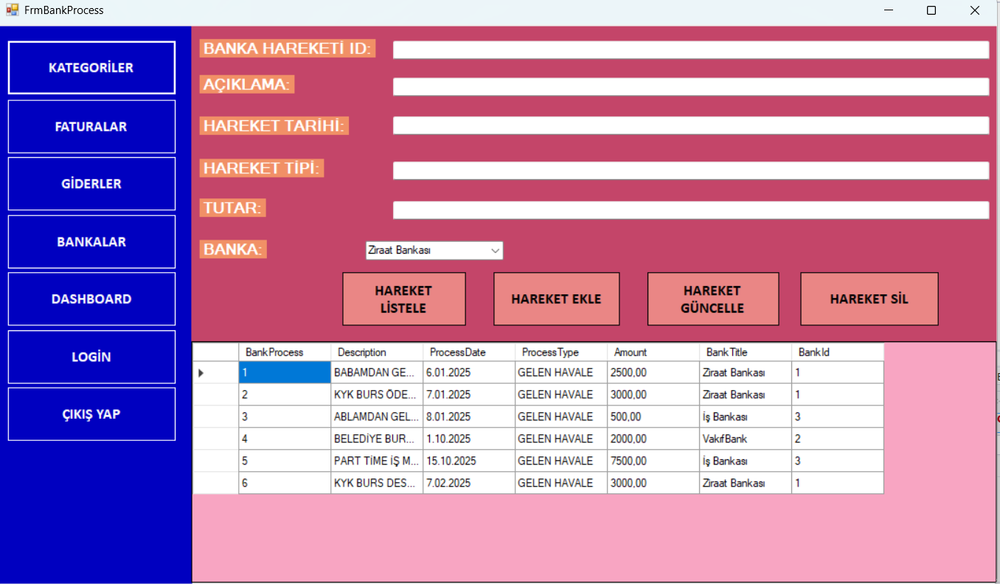
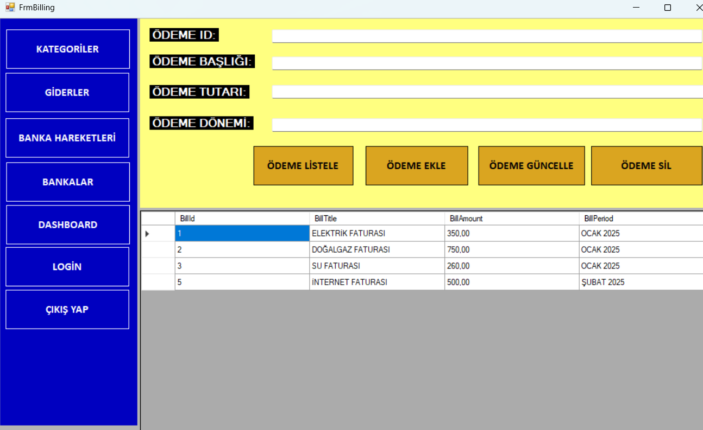
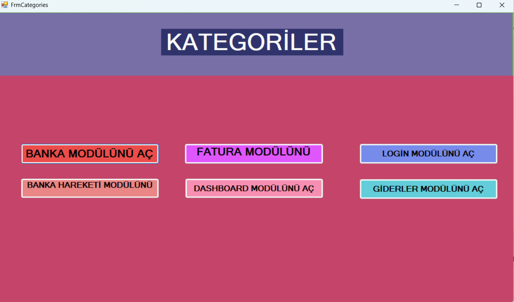
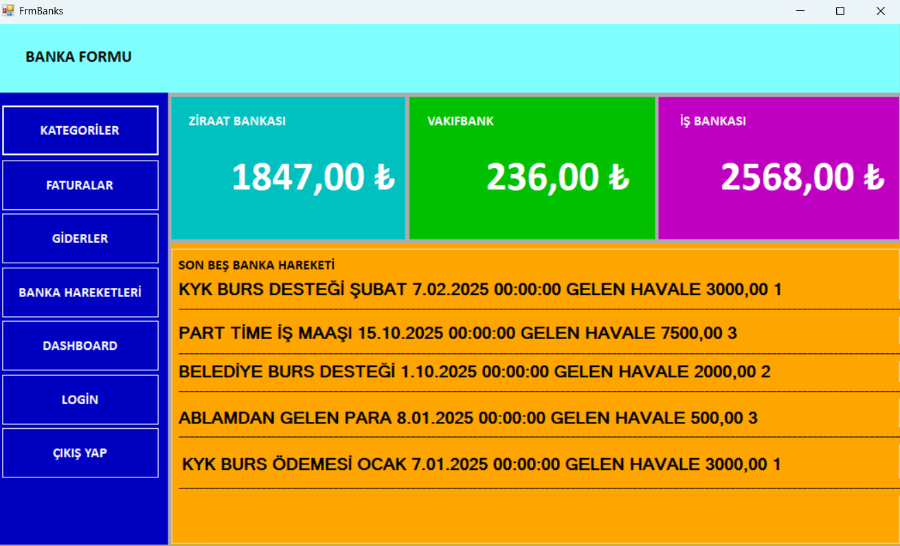
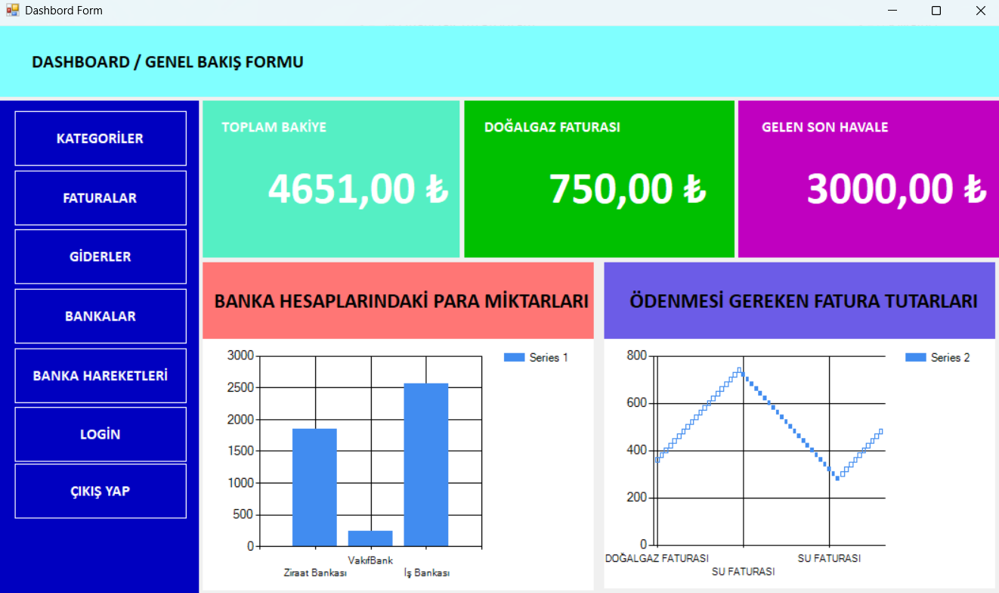
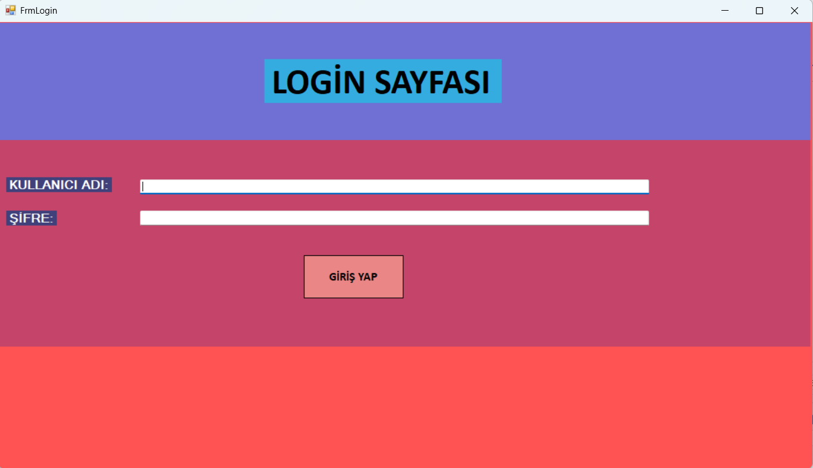
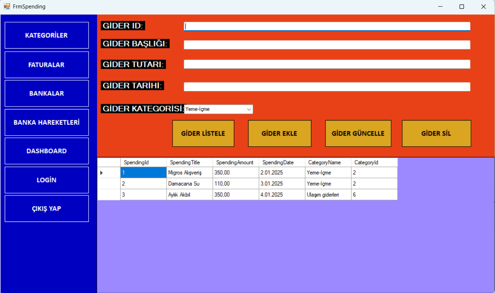

#  💻 FinancialCrm Windows Forms Uygulaması

Bu proje, **C#**, **MS SQL** ve **Entity Framework** teknolojilerini kullanarak geliştirilmiş bir Windows Forms uygulamasıdır. Proje, temel olarak **fatura yönetimi**, **kategori yönetimi**, **banka işlemleri**,**dashboard**,**kategori formu**,**Login**,**Banka hareketi işlemleri** ve **giderler yönetimi** özelliklerini içermektedir.

---

### ⚙️ Proje Özellikleri

**Banka hareketi işlemleri(BankProcess):**

Banka hareketlerini oluşturma, güncelleme, silme ve listeleme işlemi ve banka hareketlerini görüntüleme.



---

**Fatura Yönetimi (Bill):**

Faturaları oluşturma, güncelleme, silme ve listeleme işlemi ve fatura detaylarını görüntüleme.



---

**Kategori Yönetimi (Categories):**

Diğer 6 adet forma ulaşmak için oluşturduğum bir formdur. 6 adet düğme bulunmaktadır.



---

**Banka İşlemleri (Bank):**

Bankalarda toplam ne kadar bakiye var onun bilgisi ve bankalardaki son beş hareket bulunmaktadır.



---

**Dashboard:**

Genel performans ve işlem özetlerinin görüntülendiği bir ana ekran. Dinamik grafikler ve raporlar.



---

**Login:**

Uygulamalara ulaşmak için oluşturduğum login formunda kullanıcı adı ve şifre girildiği taktirde kategoriler formu açılıyor. Şifre ve kullanıcı adı sql ile uyuşursa formlar açılıyor, açılmazsa messagebox ile uyarı yazısı gösteriyorum. Kodlar aşağıdaki gibidir.

```C#
private void btnEntry_Click(object sender, EventArgs e)
{
	string userName = txtUserName.Text;

	string password = txtPassword.Text;

	if (userName == "Admin" && password == "1234")
	{
		FrmCategories frmCategories = new FrmCategories();

		frmCategories.ShowDialog();
	}
	else 
	{
		MessageBox.Show("HATALI KULLANICI ADI VEYA ŞİFRE","HATA",MessageBoxButtons.OKCancel,MessageBoxIcon.Error);
	}
}
```



---

**Giderler Yönetimi(Spending):**

Giderleri oluşturma, güncelleme, silme ve listeleme işlemi ve gider detaylarını görüntüleme.



---

### ⚙️ Kullanılan Teknolojiler

1. **C#:** Projenin temel programlama dili.
2. **Windows Forms:** Kullanıcı arayüzü geliştirme.
3. **Entity Framework:** Veritabanı işlemleri için ORM aracı.
4. **MS SQL:** Veritabanı yönetimi.